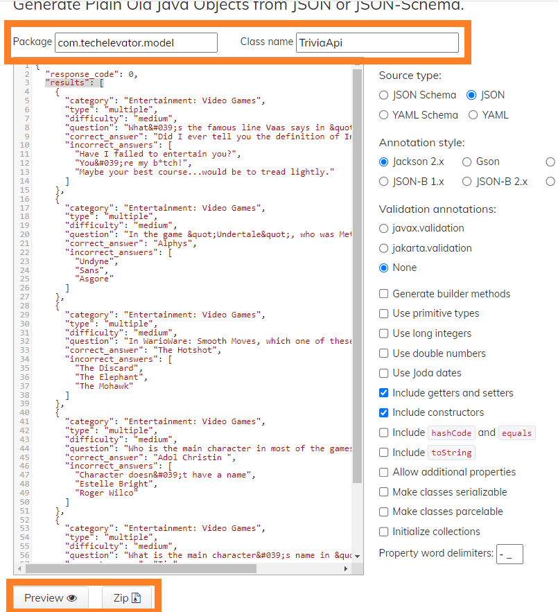

# QuizMaker with DAO
<<<<<<< HEAD
This version of QuizMaker uses an API, [Open Trivia API](https://opentdb.com/api_config.php)
=======
>>>>>>> caf72561c38d1169c06b86b65c4a92c4378ec333

## Miscellaneous

The model classes used in this starter code were generated from [jsonschema2pojo.org](https://www.jsonschema2pojo.org/) with the following settings:

